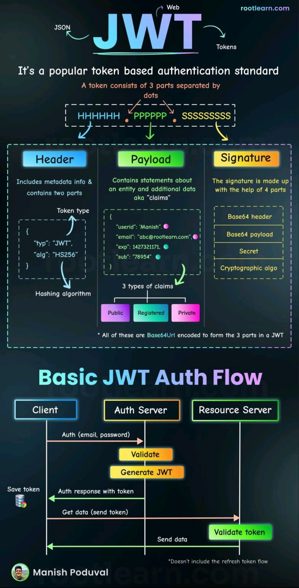

# spring-security-jwt-example

JWT explained :

1. User Authentication: The JWT flow starts when a user tries to authenticate with a server or application. The user provides their credentials, such as username and password.

2. Server Validation: The server verifies the user's credentials by checking them against a user database or an authentication service. If the credentials are valid, the server generates a JWT.

3. JWT Generation: The server creates a JWT, which consists of three parts: a header, a payload, and a signature. The header contains the algorithm used for signing the token, and the payload contains information about the user or any additional data needed.

4. Token Issuance: The server sends the JWT back to the client as a response to the authentication request. The client receives the JWT and typically stores it securely, such as in local storage or a cookie.

5. Token Usage: In subsequent requests to protected resources or APIs, the client includes the JWT in the request header, typically as the "Authorization" header with the value "Bearer [JWT]". This indicates that the client is authorized to access the requested resource.

6. Token Verification: When the server receives a request with a JWT, it validates the token's signature using a secret key or a public key. It also checks the token's expiration time, audience, and other claims to ensure its authenticity and integrity.

7. Access Granting: If the JWT is valid and passes all verification checks, the server grants access to the requested resource or API endpoint. The server extracts the information from the JWT's payload to identify the user and perform any necessary authorization checks.

8. Token Refresh (optional): If the JWT has an expiration time, the client may need to refresh it before it expires. The client can send a refresh token to the server to obtain a new JWT without requiring the user to reauthenticate.

JWTs are stateless, meaning the server doesn't need to store any session information. Instead, all the necessary data is contained within the token itself, making JWTs a popular choice for implementing authentication and authorization in web applications.

